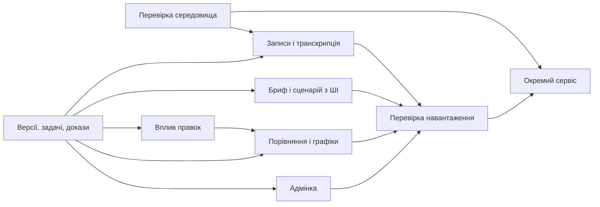

# Research: план завершення реалізації

Дата: 24 вересня 2026. База: `5331954`, гілка `codex/research-service-architecture`.
Статус: план наступних робіт; наведені нижче нові можливості ще не реалізовані.

Мета — довести наявну beta до окремого сервісу, де команда готує дослідження
разом із ШІ, завантажує інтерв'ю, отримує звичні саммарі за спільними критеріями
та бачить обґрунтовані загальні результати. Наявні auth, база, адмінка й рушій
саммарі використовуються повторно. Новий репозиторій не потрібен.

Поточні реалізовані можливості й перевірки описані в
[research-implementation-status.md](research-implementation-status.md).
Цей документ деталізує залишок P0–P7 попереднього архітектурного плану, а не
пропонує виконувати вже завершені частини повторно.

## 1. Порядок і залежності

| Етап | Результат для користувача | Передумови | Обсяг |
| --- | --- | --- | --- |
| R0 | Підготовлене тестове середовище й перевірений шлях запуску | Поточна beta | Середній; залежить від доступу до інфраструктури |
| R1 | Єдині задачі, критерії успіху та версії джерел | Контракти поточної beta | Великий |
| R2 | Завантаження запису → фонова транскрипція → саммарі | R1; Storage/worker перевірені в R0 | Великий |
| R3 | Спільна з ШІ підготовка брифу й сценарію інтерв'ю | R1 | Середній |
| R4 | Зрозуміло, чи впливає правка транскрипту на висновки | R1; набір прикладів для оцінювання | Середній |
| R5 | Порівняння задач, графіки та повніше узагальнення | R1, R4; результати аналізу з доказами | Великий |
| R6 | Керування доступом, лімітами й обробкою в нашій адмінці | R1; для media-підтримки R2 | Середній |
| R7 | Контроль витрат і перевірена робота під навантаженням | R2–R6 | Великий |
| R8 | Окремий піддомен і контрольований запуск | R0; для повного v1 R1–R7 | Середній; залежить від хостингу |

Перший порядок виконання: **R0 → R1 → R2 → R3 → R4 → R5 → R6 → R7 → R8**.
R0 не блокує локальне проєктування R1. Мінімальний екран beta-доступу з R6
доцільно зробити разом із R2, щоб пілот не залежав від ручного редагування бази.
За послідовної роботи одного допоміжного агента решту етапів виконуємо по черзі.
Обсяг — оцінка складності, не обіцянка календарних строків.

## 2. R0 — схема, середовище і шлях релізу

**Зробити:** звірити реальну схему staging з трьома Research-міграціями:
таблиці, constraints, тригери реєстрації, RLS, grants, усі SECURITY DEFINER RPC
та адмінські views. Окремо перевірити унікальність `workspaces.owner_id`, яку
поточна міграція навмисно не змінює автоматично. Підготувати точкові міграції
для виявлених відмінностей та порядок їх застосування.

Перевірити реальну маршрутизацію Hostinger: чинний workflow завантажує client
і admin у каталоги вебсервера, а Express також уміє віддавати SPA. Визначити
одне джерело Research-статики, document root/проксі для `/api`, DNS/TLS і спосіб
запуску постійного worker. Якщо тариф не підтримує worker, залишити API на
поточному хості, а worker розмістити окремим процесом/контейнером. Новий Auth
або нову базу для цього не створювати.

Узгодити й перевірити одну підтримувану Node-версію: зараз deploy використовує
20, а нові Research checks — 24. Створити окремі staging credentials; браузер
отримує тільки публічні Supabase-параметри. Додати облік виконаних міграцій
із checksum і блокуванням одночасного застосування; міграції не запускати
повторно на кожному старті сервера.

**Готово, коли:** міграції проходять на staging; власник, учасник і стороння
людина перевірені через API та прямий Supabase; старі IteroJM CRUD/тарифи
працюють; описано відтворюваний запуск і відкат. Локальні PGlite-тести
залишаються швидкою перевіркою, а staging перевіряє справжні PostgREST/RLS.

## 3. R1 — структуроване дослідження та історія джерел

Ціль і необов'язковий текстовий бриф уже є. Доповнити їх явними задачами,
які всі інтерв'ю цього дослідження перевіряють за однаковими правилами.

**Дані:**

- `research_study_versions`: незмінний знімок спільної цілі, брифу,
  дослідницьких питань, гіпотез, опису/версії прототипу та сценарію. Заголовок
  дослідження може змінюватися без нової аналітичної версії; змістові поля — ні.
- `research_study_tasks`: задачі конкретної версії, стабільні `task_id`, порядок,
  інструкція та критерій успіху. Суттєва зміна критерію створює нову версію;
  результати різних критеріїв автоматично не змішуються.
- `research_transcript_versions`: знімки транскрипту з незмінними ID сегментів,
  автором/походженням і посиланням на запис. Поточні `interviews.transcript_data`
  лишаються сумісною проєкцією; редагування записує нову версію атомарно.
- `research_study_participants`: необов'язкові псевдонімні учасники й прив'язка
  сесій до них. Один учасник може мати кілька інтерв'ю. ПІБ/email для аналітики
  не потрібні; без такої прив'язки система рахує сесії, а не «унікальних людей».
- Для analysis jobs — точні посилання на версії, налаштування й версію pipeline.
  Для старих даних створити лише знімок фактично наявного стану; втрачену
  історію не відновлювати припущеннями.

**Черга:** розширювати наявну `research_analysis_jobs` новими типами поступово,
з типізованими перевірками входів: `transcription`, `brief_draft`, `guide_draft`,
`transcript_impact`, `task_evidence`. Зберегти поточні summary/synthesis API.
Додати залежності між jobs, ключ наміру користувача, версію pipeline, прогрес
та контрольований cancel/retry. Не додавати нові типи до поточного worker
через загальний `else`: він зараз трактує решту jobs як synthesis.

Claim отримує перелік підтримуваних типів/версій worker. Спочатку випускаємо
схему й сумісний worker, потім API, що створює нові jobs. Ідентичний повтор
запиту повертає той самий логічний запуск; явна повторна генерація є новим
наміром. Timeout і бюджет спроб визначаються типом job.

**Ліміти:** додати Research-resolver у `server/billing/entitlements.js`,
залишивши SQL атомарним джерелом резервування. Окремо обліковувати обсяг
сховища, транскрибовані хвилини та AI-операції підготовки/аналізу. Перехід із
поточних beta-grants переносить уже витрачені квоти; історія не обнуляється.
Комерційні ціни на цьому етапі не вводяться.

**UI/API:** редактор задач і критеріїв на сторінці дослідження; список версій;
`GET /studies/:id/versions`, `POST /studies/:id/versions` з очікуваною ревізією;
`GET /interviews/:id/transcript-versions`. Простий сценарій «лише ціль» зберегти.

**Готово, коли:** будь-який висновок відтворювано пов'язаний зі своїм контекстом;
зміни під час генерації не перезаписують новіші дані; зберігаються старі
summary-контракти, а історичні результати не стають актуальними автоматично.

## 4. R2 — завантаження та фонова транскрипція

**Повторне використання:** виділити з `server/index.js` підготовку медіа,
`transcribeAudioWithProviderFallback`, provider adapters, нормалізатори та
пов'язані налаштування в `server/modules/interviews/transcription/`.
Залишити порядок вибору провайдера, fallback, формати та quality-настройки
еквівалентними наявним. Зараз вибір залежить від запису, тому не замінювати
його спрощеним правилом «завжди OpenAI» або «завжди Gemini».

Старий `processInterviewAudioUpload` поєднує транскрипцію із записом у БД та
видаленням локального файла. Research worker має викликати виділений сервіс
і зберігати результат власною транзакцією з перевіркою версій. На першому
кроці старий маршрут продовжує працювати через адаптер; два шляхи не повинні
одночасно обробляти одну Research-сесію.

**Дані й потік:** `research_source_assets` з workspace/interview, незмінним
object key, розміром, checksum, перевіреним типом/тривалістю, статусом і строком
зберігання. Приватний bucket; API створює upload-сесію, браузер завантажує
файл із можливістю продовження, API підтверджує завантаження і ставить job.
Фактичний формат/розмір/тривалість перевіряються сервером, а не довіряються
назві файла чи browser metadata. Після завершення upload джерело має бути
незмінним; повторний upload отримує новий asset. Worker звіряє checksum.

Квота на зберігання резервується при upload-init, на транскрипцію — після
перевірки тривалості й до платного виклику. Незавершені upload-сесії мають TTL.
Завдання переживає restart; тимчасові файли чистяться після обробки; оригінал
зберігається за налаштованим retention. Видалення джерел — окремий ідемпотентний
процес, який враховує активні jobs і не відновлює видалені дані при retry.

**API/UI:** `POST /interviews/:id/uploads`, `POST /uploads/:id/complete`,
`GET /uploads/:id`; завантаження, прогрес, помилка й повтор у кімнаті інтерв'ю.
Запропонований default: дія «Завантажити й проаналізувати» одразу дозволяє
ланцюжок transcription → summary; є варіант спочатку перевірити транскрипт.
Закриття вкладки не зупиняє серверну обробку завершеного upload.

Не переносити загальний timeout 90 секунд на транскрипцію: чинний pipeline
має довші provider-timeout. Зберегти його поведінку, але обмежити загальну
кількість викликів, щоб retry worker не множив внутрішні retry/fallback.

**Готово, коли:** запис проходить до звичного саммарі; перевірено restart у
середині обробки, повтор complete, перевищення лімітів, чужий asset, підміну
файла, помилку ffmpeg/provider та редагування джерела під час роботи.
Якість діаризації/транскрипції порівняна з поточним pipeline на контрольних
UA/EN записах; клієнтські помилки не списують квоту як успішний результат.

## 5. R3 — бриф і сценарій разом із ШІ

**Сценарій:** «Допоможи підготувати дослідження» → короткий опис → уточнення
того, чого бракує → чернетка цілі, гіпотез, задач і критеріїв → редагування
людиною → збереження версії. Далі — сценарій інтерв'ю: вступ, нейтральні
питання, задачі на прототипі та уточнення після їх виконання.

ШІ пропонує зміни, користувач приймає їх. Згенерована чернетка не перезаписує
активну ціль. Нез'ясовані припущення позначаються; гіпотези не стають висновками
про респондентів. Вільний бриф і ручне створення залишаються доступними.

Зіставити бажані результати тесту з наявними секціями: `testedProductContext`,
`taskSuccess`, `whatWorked`, `whatDidNotWork`, `confusionsObjections`,
`featureRequests`, `actionableRecommendations`, `quotes`. Налаштування Research
можуть обирати вже підтримувані секції; старі пресети IteroJM не змінюються.

**Код/API:** `server/modules/research/preparation/`, форми Research;
`POST /studies/:id/brief-jobs`, `POST /studies/:id/guide-jobs`, читання job,
`POST /studies/:id/versions` для явного прийняття з перевіркою базової версії.
Кожен платний запуск показує стан і враховується в ліміті.

**Готово, коли:** можна підготувати й прийняти сценарій без повного брифу;
два паралельні редагування не гублять правки; сценарій і наступні саммарі
посилаються на однакові задачі/критерії; немає вигаданих «результатів тесту».

## 6. R4 — оцінка впливу виправлень

Порівнювати новий транскрипт із версією, з якої створено саммарі, а не лише
з останньою правкою. Це враховує кілька послідовних редагувань.

Детерміновані правила лишають whitespace-зміни без платного виклику.
Для решти — job оцінки впливу з результатом `unaffected`, `affected` або
`uncertain`, причинами та переліком зачеплених секцій/доказів. Зміни мовця,
заперечень, чисел, успішності задач, видалення цитат і перебудова сегментів
мають окремі контрольні приклади. Пунктуацію не вважати завжди несуттєвою.

**Запропонований default:** після збереження показати «Перевірити вплив»;
ШІ рекомендує залишити саммарі або оновити його. Автоматичний запуск перевірки
можна додати як явне налаштування. Повна регенерація не запускається приховано.
Для `uncertain` попередження залишається. Старе саммарі доступне для читання.

Зберігати `research_summary_validations`: яке саммарі перевірено проти яких
версій, результат, докази й рішення користувача. При підтвердженні актуальності
не переписувати історичне «згенеровано з версії X». Узагальнення враховує нову
валідацію у своєму manifest; відповідь перевірки для застарілої версії не знімає
попередження з новішої. Зміни цілі/критеріїв спочатку консервативно потребують
повторного аналізу, а не автоматичного визнання старого саммарі актуальним.

**Код/API:** `server/modules/research/impact/`,
`POST /interviews/:id/impact-jobs`, revision-checked endpoint рішення про
актуальність; індикатор і пояснення у кімнаті інтерв'ю.

**Готово, коли:** контрольні критичні зміни не отримують хибного висновку
«нічого не змінилося»; невизначеність видима; перевірено багатокрокові правки
та завершення classifier job після нової правки. Дешевшу модель для цієї
окремої операції обирати тільки після оцінювання; модель саммарі не знижувати.

## 7. R5 — порівняння, графіки й розвиток узагальнення

Спочатку побудувати перевірювані дані. Наявна `taskSuccess` містить текстові
формулювання й обмежену кількість елементів; цього недостатньо, щоб обіцяти
повну матрицю всіх запланованих задач. Не змінювати її legacy-контракт заради
графіків: додати Research-аналіз доказів, що охоплює кожен `task_id`.

`research_task_outcomes` пов'язує analysis run, версію дослідження, задачу,
сесію/учасника, результат і посилання на сегменти конкретного транскрипту.
Стани: успішно, частково, неуспішно, не виконувалась, недостатньо спостережень.
AI-пропозиція та ручне виправлення зберігають авторство/версії; невідомий
результат не замінюється невдачею. Summary-first інтерфейс зберігається.

**Перші візуалізації:** таблиця «сесія × задача», стовпчики результатів за
задачами, покриття запланованих задач та перелік повторюваних проблем із
джерелами. Будувати через наявний у репозиторії Recharts.

Числа обчислює сервер із структурованих фактів. Частка повного успіху =
успішні / (успішні + часткові + неуспішні зафіксовані спроби). Поруч показувати
знаменник, невиконані та невідомі задачі; нуль спроб означає «немає даних».
Метрики за людьми доступні лише для явно визначених учасників; повторні сесії
не рахуються як нові люди. Не порівнювати непогоджені версії критеріїв/прототипу
в одному відсотку. Час виконання показувати тільки за надійними спостереженнями.

Наявний synthesis зберегти опціональним. Додати до нього покриття, виключені
застарілі/невідомі джерела, розбіжності та докази. Для великих вибірок —
поетапне узагальнення з бюджетом входу, кешуванням незмінних частин та
збереженням ID первинних інтерв'ю. Зміна одного джерела перебудовує залежні
частини; кожна стадія має перевірений manifest. Кількість проміжних згадок
не перетворюється на кількість респондентів. Ліміти великих вибірок визначити
в R7, до цього перевищення пояснювати явно, без тихого обрізання джерел.

**Код/API:** `server/modules/research/evidence/`, `analytics/`,
`GET /studies/:id/results`, `POST /interviews/:id/evidence-jobs`,
revision-checked ручне уточнення outcome, вкладка результатів дослідження.

**Готово, коли:** кожне число й твердження має доступні джерела; tests
перевіряють знаменники, повторні сесії, пропуски, зміну версій і ручні правки;
великі звіти зберігають незручні/суперечливі результати, а не лише більшість.

## 8. R6 — Research у наявній адмінці та доступ команди

Додати `admin/src/pages/research/` і ресурси Refine у чинний `admin/src/App.tsx`.
Мінімальний beta-екран: видати/продовжити/відкликати grant, налаштувати ліміти,
показати використання та workspace. Наступний екран: черга, стан worker,
помилки обробки, контрольований повтор/cancel і source-retention.

Нові `/api/admin/research/*` перевіряють `profiles.role === 'admin'` сервером.
Research-операції йдуть через цей API, оскільки прямий browser CRUD нових
таблиць навмисно закритий. Зміни grants, лімітів, повтори й видалення мають
audit trail. Підтримка за замовчуванням бачить службові дані; доступ до
змісту інтерв'ю — окрема авторизована дія, не вкладення в кожну помилку.

Для команд — owner-керовані Research-запрошення з expiry, одноразовим
прийняттям і перевіркою акаунта. Прийняття не створює зайвий workspace і
не приймає запрошення іншого продукту. Залишити початкові ролі owner/member;
додаткові ролі вводити тільки з узгодженою матрицею можливостей.

**Готово, коли:** пілот можна підтримувати без ручного SQL; звичайний
користувач не може викликати admin API; повтор job не обходить ліміт;
відкликання доступу припиняє нові платні виклики; IteroJM-тарифи не змінюються.

## 9. R7 — масштабування, витрати та спостереження

Додати обмеження паралельності за типом операції, workspace і провайдером,
справедливий вибір між командами, backpressure і Retry-After для перевантаження.
Зберегти DB leases/fencing; живий ffmpeg має окремі CPU/пам'ять/часові межі.
Один worker залишається базовою конфігурацією до проходження load tests.

Вимірювати час очікування й виконання, прогрес, помилки, повторні спроби,
втрату lease, вік найстаршого job, обсяг сховища та використання AI.
Логи містять job/workspace IDs, а не транскрипти, ключі або signed URLs.
Показати стан worker й застряглі jobs в адмінці. Налаштувати реакцію на
відсутність heartbeat, перевищення бюджету й накопичення черги.

**Перевірки:** кілька справжніх PostgreSQL-з'єднань/worker-процесів; одночасні
enqueue й резервування; вимкнення процесу; timeout/429 провайдера; великі
записи та synthesis; видалення/відкликання доступу під час обробки.
Фіксувати окремо витрати провайдера й користувацьку квоту: повтор зовнішнього
AI-виклику після збою можливий, подвійне користувацьке списання — ні.

Початкові тестові профілі: одна команда; п'ять команд з одночасною роботою;
сплеск у три рази від обраного beta-навантаження. Це параметри тесту, не
обіцянка ємності. На підставі вимірювань зафіксувати max file/duration,
max study size, concurrency, допустиму чергу й бюджет. Для чинного IteroJM
порівняти p95 з базовим вимірюванням; початковий критерій — погіршення не
більше 20% на погодженому beta-профілі, з уточненням після R0.

**Готово, коли:** система дотримується перевірених лімітів, переживає
перезапуск і піки без втрати даних, жодна команда не займає всі слоти,
а поточний продукт лишається в узгодженому бюджеті затримки.

## 10. R8 — піддомен і запуск

Додати окремий Research build/deploy artifact і каталог, preview/staging URL,
health/readiness checks API та worker. Усі build-параметри Research окремі від
маркетингу/client; порядок schema → сумісний backend/worker → frontend → flags
перевіряється на staging. Піддомен `research.iterojm.com` поки робочий.

Перевірити DNS/TLS, proxy `/api`, CORS, Supabase redirect allowlist, реєстрацію,
підтвердження email та recovery. Спільний акаунт з окремою сесією на піддомені
залишається default; SSO між піддоменами — окреме покращення, якщо потрібне.

Спочатку ввімкнути внутрішній pilot. Відтворити наскрізний сценарій із двома
командами й стороннім акаунтом: підготовка → запис → саммарі → правка →
перевірка актуальності → узагальнення/графіки → підтримка в адмінці.
Після приймання розширювати beta-доступ. Перед production-ввімкненням показати
власнику конкретний staging-результат, виміряні межі й готовий порядок відкату.

Відкат вимикає Research UI/нові jobs та зупиняє їх приймання, але зберігає
дані й `PRODUCT_SCOPE_ENABLED=true`. Після появи Research-даних не повертати
код без продуктової ізоляції. Перевірити відновлення з резервної копії та
завершення/скасування вже прийнятих jobs.

**Готово, коли:** продукт доступний за окремим URL, повний сценарій працює на
справжній інфраструктурі, перевірені спостереження й rollback, підтримка може
керувати доступом без втручання розробника.

## 11. Межі першої завершеної версії та подальші рішення

Для повного погодженого сценарію потрібні R0–R8. Раніше можна дати внутрішній
пілот поточного summary-first сценарію після R0, R1, R2, мінімальної адмінки та
обмеженого staging-випуску R8; це не означає завершення решти бізнес-потреб.

Платні Research-тарифи/checkout/webhooks плануються окремим R9 після рішення
про одиницю оплати. У R9 входять product-aware provider mapping, ідемпотентні
webhooks, ledger, зміни тарифів і refund-поведінка. Наявну IteroJM-підписку
не використовувати як неявну оплату Research. Beta-grants дозволяють завершити
продуктовий пілот без передчасного вибору комерційної моделі.

Робочі припущення: автоматичне саммарі лише як частина обраної користувачем
дії upload; AI-правки брифу потребують прийняття; оновлення після редагування
рекомендоване, не приховане; спочатку прості графіки з джерелами. До зовнішнього
запуску уточнити назву/домен, очікувані обсяги записів, retention, автоматичність
перевірки впливу та beta-ліміти. Планування й локальна реалізація від цього
не зупиняються; залежні production-параметри не вгадуються.

## 12. Виконання з контрольованими ресурсами

Один головний інтегратор і максимум один допоміжний агент одночасно.
Короткі інвентаризації — `Luna / low`, обмежені зміни backend/UI —
`Sol / medium`. Головний агент перевіряє ізоляцію, міграції, конкурентні записи
та збереження якості саммарі. Дорогі повторні дослідження всього репозиторію
не потрібні: використовувати цей план і короткий контекст поточного етапу.

Кожний етап ділиться на завершені зміни: схема/контракт → backend → UI →
цільові перевірки → інтеграція. Спільні файли має один виконавець; план не
передбачає одночасного редагування `server/index.js` кількома агентами.
Тести розширюються під нові ризики; повні перевірки запускаються на межі етапу,
а не після кожної зміни тексту. Підтримувати окрему гілку та оновлювати статус
реалізації після фактичного проходження критеріїв, а не після появи файлів.

Перші конкретні задачі: R0-аудит схеми/хостингу; R1-контракт study/task/source
версій; R1-сумісні міграції й worker capabilities; після цього R2-виділення
транскрипції. Зміни функціонального коду цим документом не виконуються.
