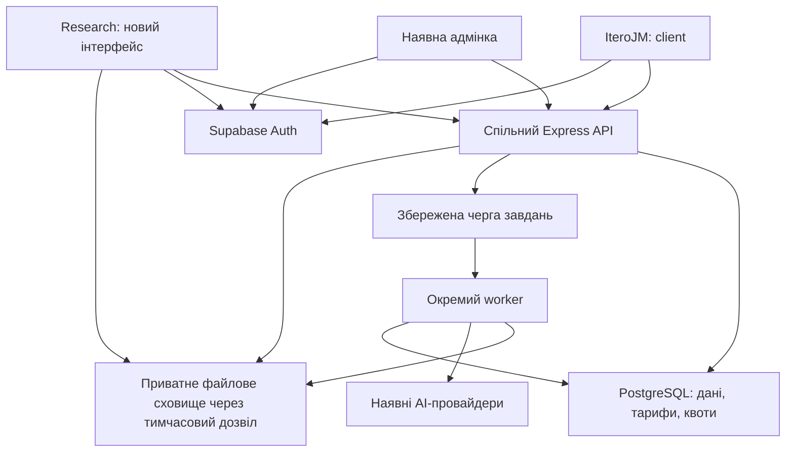

# Окремий сервіс аналізу досліджень: архітектурний план

Дата: 24 вересня 2026. Версія: 0.3 — архітектура та реалізований локальний зріз Research beta.

Гілка: `codex/research-service-architecture`. Початкова ревізія: `437d90c` (`main` локального репозиторію).

Статус: після погодження власником реалізовано локальний зріз: окремий застосунок, продуктова ізоляція, дослідження/брифи, транскрипти, спільний рушій саммарі, фонова генерація та узагальнення. Це ще не production-реліз. Міграції не застосовані до зовнішніх баз; фактична схема Supabase й інфраструктура залишаються неперевіреними. `Research` і `research.iterojm.com` — робочі назви. Фактичний контракт, перевірки, обмеження та порядок запуску: [research-implementation-status.md](research-implementation-status.md). Решта документа описує також наступні етапи, які ще не реалізовані.

## 1. Рішення та межі поточного плану

Створити самостійний Research-застосунок у поточному npm-монорепозиторії. Використовувати наявні Supabase Auth, PostgreSQL, адмінку та серверну реалізацію саммарі. Додати окрему продуктову область, керовану обробку записів і незалежну публікацію інтерфейсу.

Для користувача це окремий продукт: власний вхід, навігація, початок роботи, тарифи та результати. Для розробки — два продуктові інтерфейси зі спільними перевіреними компонентами та одним сервером на першому етапі.

Пріоритет власника продукту: зберегти якість і можливості поточного саммарі. Розділення продуктів саме по собі не є підставою змінювати промпти, модель, секції або спосіб об'єднання результатів.

| Фіксуємо як технічну основу | Уточнюємо під час бізнес-обговорення |
| --- | --- |
| Окремий React/Vite-застосунок у цьому репозиторії | Назва, домен, позиціювання, сценарій першого входу |
| Спільні облікові записи Supabase | Чи потрібен одразу перехід між продуктами без повторного входу |
| Повторне використання рушія саммарі | Нові види аналізу, звіти, агрегація кількох сесій |
| Перевірка доступу й лімітів на сервері | Окремі команди чи спільний простір між продуктами |
| Надійна черга тривалих завдань перед масштабним запуском | Одиниця оплати: хвилини, сесії, дослідження, учасники |
| Окремий випуск Research-інтерфейсу | Обсяги записів, одночасні обробки, вимоги до часу відповіді |

Власник погодив функціональну реалізацію та роботу агентів. Бізнес-потреби BR-01–BR-06 включені нижче. Межі локального зрізу зафіксовано окремо: він працює зі збереженими транскриптами; обробка записів, допомога ШІ з брифом, платні тарифи та промислова інфраструктура — наступні етапи.

## 2. Що вже є і що реально потрібно відокремити

Висновки нижче зроблені з коду початкової ревізії, а не лише зі старих описів у `docs/`.

| Наявна частина | Джерело | Наслідок для реалізації |
| --- | --- | --- |
| Workspaces `client`, `server`, `admin` | `package.json` | Додаємо `research` і невеликі спільні пакети без зміни фреймворку |
| Інтерв'ю, папки, транскрипти, саммарі | `client/src/pages/InterviewRoom.jsx`, `InterviewsList.jsx`; `server/index.js` | Виділяємо наявні компоненти та серверні функції поетапно |
| `prototype_testing`, секції, пресети, `merge_selected` / `replace_all` | `server/index.js`: `resolveInterviewSummaryRequest`, `buildInterviewSummaryPrompt`, `mergeInterviewSummarySections` | Зберігаємо контракти й результати нормалізації |
| `interviews.workspace_id`, власники й учасники | `server/migrations/create_interviews.sql`; workspace helpers | Workspace залишається основною межею даних |
| Підписка власника, квоти за workspace | `server/billing/entitlements.js` | Потрібне явне розділення тарифів за продуктами |
| Supabase browser auth | `client/src/supabaseClient.js`, `services/auth.js`, `AuthPage.jsx` | Ті самі акаунти; сесії піддоменів не стають спільними автоматично |
| Фоновий upload через `setImmediate`, локальні тимчасові файли | `server/index.js`: `processInterviewAudioUpload`, `/upload-audio` | Для надійного перезапуску потрібні durable jobs і збережений оригінал |
| Генерація саммарі всередині HTTP-запиту | `POST /api/interviews/:id/generate-summary` | Новий API може бути асинхронним без негайної зміни старого клієнта |
| Два платіжні webhook-маршрути: Paddle і Lemon Squeezy | `server/index.js` | Перевірити обидва; не припускати, що старий маршрут вимкнений |
| Збірка app/admin у GitHub Actions, backend через Hostinger git integration | `.github/workflows/deploy-hostinger.yml` | Research потребує власного артефакту, каталогу та керованого порядку релізу |

Важливі залежності:

- `getAccessibleWorkspaceIds` і `getCurrentWorkspaceForUser` зараз не знають продукту; API списку інтерв'ю повертає дані доступних просторів, а частина фільтрації відбувається у клієнті.
- `getWorkspaceSubscriptionPlan` шукає активну підписку власника без продуктового фільтра. Призначення тарифу через адмінські маршрути може скасовувати інші підписки цього користувача.
- `ensure-starter`, автоматичне створення workspace та приймання запрошень розподілені між кількома маршрутами. Для наявного акаунта початок роботи у другому продукті не повинен залежати від умови «акаунт створений за останні 48 годин».
- Поточний облік AI-квоти перевіряє доступ перед викликом моделі, а списує після генерації. Це не є атомарним резервуванням для кількох одночасних завдань.
- Старий опис транскрипції в `docs/interview-transcription-summary-pipeline.md` частково відстає від коду: поточні provider fallback і realtime-маршрут потрібно переносити за фактичним кодом.

## 3. Цільова схема першого запуску



Схема показує цільовий шлях для нових Research-операцій. Частина існуючого Refine CRUD адмінки може залишатися через Supabase з перевіреними RLS; нові дії з тарифами, повторним запуском і завданнями проходять через admin API.

На старті спільні сервер і база означають спільну область впливу збоїв. Окремий піддомен або frontend deploy не ізолюють навантаження бази. Ізолюємо насамперед важку обробку, обмежуємо паралельність за продуктом/workspace і вимірюємо вплив на IteroJM.

### Структура коду

```text
client/                              поточний IteroJM
research/                            новий React/Vite застосунок, JS/JSX
  src/app/                           маршрути, shell, auth/workspace providers
  src/pages/                         сторінки нового продукту
  src/hooks/                         продуктові запити й jobs polling
  src/locales/                       українська та англійська
packages/
  interview-contracts/               ключі секцій, пресети, чисті перетворення
  interview-ui/                      transcript, конфігурація й показ саммарі
  browser-auth/                      наявні session/token helpers, налаштовуваний client
server/
  modules/access/                    user + workspace + product + capability
  modules/interviews/                 routes, service, repository
  modules/interviews/summary/         prompt, generation, normalization, merge
  modules/interviews/transcription/   preprocessing, providers, normalization
  modules/research/                   нові бізнес-сутності після уточнення
  jobs/                              enqueue, claim, lease, retry, persistence
  workers/research.js                 окремий process entrypoint
  billing/entitlements.js             єдине джерело прав і лімітів
  migrations/                        лише нові адитивні SQL-міграції
admin/                               спільне керування продуктами
e2e/research/                         нові сценарії
```

Спільні пакети вводимо лише для коду з двома реальними споживачами. Не переносимо всі компоненти в абстрактну платформу. Backend залишається CommonJS; export-поверхня `interview-contracts` повинна працювати і з `require`, і зі збіркою Vite. AI-промпти й секрети не потрапляють у браузерний пакет.

`InterviewRoom` не копіюємо цілком: спочатку відокремлюємо показ транскрипту, конфігуратор секцій і відображення саммарі від роутера, workspace orchestration та запитів. Shared UI отримує callbacks/data; вибір API залишається в застосунку. Нові query keys містять product, user і workspace; старі ключі IteroJM змінюємо лише окремим узгодженим кроком.

## 4. Ідентичність, робочі простори й доступ

### Робоче рішення ADR-01: окремий workspace на продукт

Пропозиція до бізнес-уточнення: `workspaces.product_key ∈ {iterojm, research}`. Один акаунт може володіти або бути учасником просторів обох продуктів. Існуючі простори, членства й дані залишаються IteroJM; увімкнення Research створює або обирає Research-простір, не переносить старі записи.

Це дає простий зрозумілий доступ, окрему команду та однозначну належність квот. Повторне використання старого інтерв'ю можливе пізніше через явне копіювання/імпорт із перевіркою доступу до джерела та призначення. Автоматична синхронізація й видимість між продуктами до першої версії не входять.

Якщо бізнес потребує одного спільного простору та тих самих живих інтерв'ю в обох продуктах, ADR-01 переглядаємо ДО міграцій: потрібні `workspace_products`, окремі product entitlements і правила видимості кожного ресурсу. Не намагаємося імітувати спільний простір двома некерованими копіями даних.

### Перевірка запиту

1. Перевірити Supabase bearer token на сервері.
2. Визначити продукт зі змонтованого router: legacy API → `iterojm`, `/api/research/*` → `research`.
3. Завантажити workspace/ресурс, перевірити продукт, власника або членство та дозволену дію.
4. Перевірити entitlement і зарезервувати квоту для платної операції.
5. Виконати дію через доменний service.

`Origin`, назва піддомену, UI-прапорець і довільний `product_key` із body не є доказом права доступу. Запит до legacy API з ID Research-ресурсу також має проходити продуктову перевірку. Однаковий принцип поширюється на папки, портрети, експорт, запрошення, видалення workspace й realtime-token.

RLS захищає дані навіть при прямому зверненні до Supabase. Для Research-операцій, що змінюють дані, використовується backend: браузерні INSERT/UPDATE/DELETE політики мають не дозволяти обхід entitlement/квот. Читання — за членством і дозволеним режимом доступу. Legacy-політики перевіряються окремо, щоб нові Research-рядки не стали доступні через старе permissive правило. Service-role запити завжди отримують серверно перевірений scope.

Worker і SQL-функції обліку недоступні для виклику звичайним `authenticated` користувачем. Перед обробкою повторно перевіряємо існування ресурсу й актуальність дозволу; видалений або недоступний ресурс завершує завдання без публікації результату.

### Початок роботи й сесія

- Новий Research-клієнт використовує наявний Supabase project та той самий обліковий запис.
- `POST /api/research/bootstrap` ідемпотентно приймає Research-запрошення або створює стартовий простір і дозволений початковий доступ. Унікальний ключ onboarding `(user_id, product_key)` і транзакційне блокування усувають дублікати без заборони майбутніх додаткових просторів.
- Читання списків нового API не створює акаунти/підписки. Legacy side effects спочатку обмежуємо IteroJM, згодом виділяємо в явний bootstrap.
- Логін, OAuth, підтвердження пошти й відновлення пароля повертають користувача в правильний продукт. Налаштувати точні redirect URL і шаблони листів.
- Початковий варіант — незалежні browser sessions з одним акаунтом. Без повторної реєстрації, але можливий окремий вхід на кожному піддомені. SSO, якщо потрібне, проєктуємо окремо; не передаємо access/refresh tokens у саморобних URL між застосунками.
- Logout очищує кеш користувача; продуктова політика локального/глобального виходу має бути явною.

## 5. Дані та послідовність міграцій

Спільна production-база з логічним розділенням за workspace. Preview/staging використовує окреме тестове середовище Supabase: гілка коду не ізолює production-дані.

| Міграція (запропонована назва) | Зміна | Умова готовності |
| --- | --- | --- |
| `add_product_scope.sql` | `product_key` у `workspaces`, `plans`, `subscriptions`; onboarding state | Backfill старих рядків як `iterojm`; product не змінюється довільним клієнтом |
| `scope_product_access_policies.sql` | Політики доступу, product-aware views/RPC та індекси | Прямий Supabase-доступ не обходить межі нового продукту |
| `create_interview_jobs_and_assets.sql` | `interview_assets`, `processing_jobs`, `analysis_runs`, revisions | Завдання й файли переживають restart; ресурс/asset/job належать одному workspace |
| `create_quota_reservations.sql` | Резервування, завершення/звільнення, ідемпотентність | Паралельні запити не перевищують ліміт і не списують повторно |
| `add_product_billing_mapping.sql` | Provider price mapping та webhook event ledger | Один тариф/платіж не змінює підписку іншого продукту |
| Після бізнес-опису | `research_studies`, tasks, observations тощо за реальною потребою | Узгоджені сутності й сценарії; без передчасного універсального JSON-контейнера |

Перед першою міграцією: звірити живу схему, виконані міграції, RLS, SQL views, тригери та обмеження. Репозиторій не вважаємо повним описом існуючої Supabase-бази. Особливо перевірити унікальність `plans.name` і обмеження на кількість workspace власника.

Основні правила моделі:

- `interviews` і `interview_folders` залишаються спільними таблицями з `workspace_id`; продукт отримуємо з workspace. Не додаємо другу незалежну копію транскриптів.
- Зв'язки folder/interview, asset/interview, job/interview мають DB-перевірку спільного workspace, а не лише перевірку в UI.
- `interviews.transcript_data`, `summary_data`, чинні status та `_system` залишаються сумісними. Додаємо `transcript_revision` і `summary_revision` для контролю конкурентних записів.
- `analysis_runs`: interview/workspace, input revision/hash, версії prompt/schema, preset/mode/sections/merge mode, provider/model, output, статус і час. Старі саммарі читаються без обов'язкового історичного run.
- `processing_jobs`: kind, workspace/interview, asset/run references, status, attempts, `available_at`, `lease_expires_at`, `lease_token`, idempotency key, input revisions, sanitized error. Жодних великих файлів або секретів у payload.
- `interview_assets`: owner/workspace/interview, bucket/object key, checksum, тип/розмір/тривалість, upload status, retention deadline. Object key не береться довільно з користувацького body.
- Індекси — під доступ за workspace, порядок списків і вибір готових jobs. Нові списки мають cursor pagination; у список сесій не віддаємо повні транскрипти й саммарі.
- Нові ресурси підтримують archive там, де це відповідає продуктовому сценарію. Остаточне видалення скасовує jobs і ставить cleanup assets у чергу; не залишає осиротілі файли.

## 6. Саммарі: збереження якості та можливість розвитку

Виділяємо один серверний `SummaryService`, який використовують старий API та Research worker. Перенесення коду й зміна поведінки виконуються різними кроками.

Незмінні на першому кроці: текст і структура prompt, вибір поточної моделі, мова відповіді, правила роботи лише з наявними свідченнями, ключі й порядок секцій, пресети, selected sections, merge modes, normalization та збереження `_system.summaryGeneration`. Research може мати власний початковий пресет `prototype_testing`, не змінюючи типовий режим IteroJM.

Перевірка збереження поведінки:

1. Підготувати дозволені знеособлені UA/EN-приклади транскриптів і збережених відповідей: service design, prototype testing, custom sections, часткове саммарі та обидва merge modes.
2. До/після extraction порівняти сформований prompt, request configuration, нормалізацію й merge на тих самих фікстурах.
3. Перевірити відображення вже збережених саммарі в обох інтерфейсах, включно з невідомими/відсутніми полями старих даних.
4. Окремо провести невелику якісну перевірку з реальною моделлю: відповідність джерелу, повнота, мова, корисність рекомендацій. Не вимагати буквального збігу двох недетермінованих AI-відповідей.

Версії prompt/schema/config записуємо для нових runs. Повторна генерація не видаляє попередній успішний результат до завершення нового. Результат для застарілої transcript revision зберігається в історії зі статусом superseded, але не перезаписує актуальне саммарі.

Публікація результату робить compare-and-swap за transcript/summary revision; паралельні зміни не губляться. Для `merge_selected` потрібне злиття з актуальним результатом у транзакції або явний conflict; для `replace_all` конфлікт не вирішується мовчазним overwrite.

Нові бізнес-потреби додаються як окремі capabilities або версії аналізу. Агрегація дослідження, аналіз екранів чи поведінкові метрики не підмішуються непомітно в поточний prompt. Транскрипт сам по собі не підтверджує кліки, час виконання або візуальні проблеми; для таких висновків потрібне погоджене джерело доказів.

## 7. Файли, черга й worker

### Базове рішення

Приватний Supabase Storage bucket для source assets; черга на PostgreSQL; окремий Node worker із наявним ffmpeg та AI adapters. Спочатку одна технологія зберігання й один worker deployment, без додавання Redis чи окремого сервісу авторизації.

Запропонована реалізація черги: коротка SQL-транзакція claim через `FOR UPDATE SKIP LOCKED`, запис lease і повернення job. Блокування не тримається під час AI-виклику. Worker підтверджує lease heartbeat; завершення дозволене лише поточному `lease_token`. PostgreSQL описує цей механізм як придатний для кількох споживачів queue-like table: [SELECT / locking clause](https://www.postgresql.org/docs/current/sql-select.html).

### Потік обробки

1. Авторизований upload-init перевіряє workspace, доступ, допустимий розмір і створює asset з випадковим object key.
2. Browser завантажує файл у приватний bucket через короткоживучий дозвіл; великі файли — resumable upload. [Supabase resumable uploads](https://supabase.com/docs/guides/storage/uploads/resumable-uploads).
3. Upload-complete перевіряє існування/розмір об'єкта, ownership та статус. Worker додатково перевіряє фактичний media type/тривалість; до валідації платний AI-виклик не запускається.
4. Одна DB-транзакція резервує квоту й створює job. API повертає `202` та `jobId`; повтор із тим самим idempotency key повертає те саме завдання.
5. Worker забирає job, завантажує файл у локальний temp, виконує чинну нормалізацію й provider fallback, атомарно записує результат та остаточний облік використання.
6. Клієнт опитує status endpoint, показує стадію, результат або можливість повторити. Для першої версії WebSocket не потрібен.

Стани jobs: `queued → running → succeeded`; тимчасова помилка → `retry_wait → running`; вичерпані спроби → `failed`; скасування → `canceled`. Після втрати lease завдання доступне іншому worker. Старий процес не може публікувати результат після втрати lease.

Обов'язкова семантика:

- Виконання at-least-once. Ідемпотентними робимо enqueue, публікацію результату та користувацьке списання. Збій після зовнішнього AI-виклику може спричинити повторну витрату провайдера; не обіцяємо exactly-once для зовнішнього API.
- Retry: обмежена кількість спроб, backoff із jitter, окремий розбір тимчасових помилок і остаточно невалідних файлів. Не перемножувати необмежено retries worker і provider adapter.
- Паралельність обмежується для всього провайдера, кожного продукту й workspace; уникати ситуації, коли одна команда займає всі слоти.
- Дані не зникають при restart API/worker. Оригінал залишається до кінця погодженого retention; локальні temp видаляються в `finally` і періодичним cleanup.
- Зміна/видалення інтерв'ю під час обробки перевіряється перед publish. Скасування позначає job; уже відправлений запит провайдеру може бути неможливо скасувати.
- Старий `/upload-audio` переноситься на цей же job service через адаптер зі збереженням сумісної відповіді. Не залишати два конкурентні способи обробки одного запису.

Місце запуску worker — окреме інфраструктурне рішення: перевірити можливість довготривалого фонового процесу в поточному Hostinger-тарифі. Якщо його немає, worker розгортається на окремому контейнерному/VPS-хості, а існуючий frontend/API залишаються на Hostinger. Ця перевірка потрібна до обіцянки строків масштабного запуску.

## 8. API першої версії

Новий namespace: `/api/research`. Успішні CRUD-відповіді зберігають стиль `{ status: 'success', data }`; jobs — `{ status: 'accepted', data: { jobId, state } }`. Помилки мають стабільний `code` і зрозуміле `message` без provider secrets.

| Маршрут | Призначення |
| --- | --- |
| `POST /bootstrap` | Початок роботи в Research; ідемпотентність |
| `GET /workspaces`, `GET /workspaces/:id/limits` | Доступні Research-простори й квоти |
| `GET/POST /workspaces/:id/interviews` | Пагінований список або створення сесії |
| `GET/PATCH /interviews/:id` | Деталі/дозволені поля, revision для конкурентного редагування |
| `GET/POST /workspaces/:id/interview-folders` | Наявна організація інтерв'ю; детальні операції за тим самим access guard |
| `POST /interviews/:id/uploads`, `POST /uploads/:id/complete` | Контрольований upload і початок транскрипції |
| `POST /interviews/:id/summary-jobs` | Наявні preset, analysisMode, selectedSections, mergeMode + idempotency key |
| `GET /jobs/:id`, `POST /jobs/:id/retry`, `POST /jobs/:id/cancel` | Статус, контрольований повтор/скасування |
| `GET /interviews/:id/analysis-runs` | Історія результатів і версій джерела |
| `/api/admin/research/*` | Огляд/підтримка jobs і використання, лише admin role |

Інші операції, зокрема realtime, archive та export, підключаються за погодженою матрицею першої версії. Наявні API IteroJM продовжують відповідати в старому форматі. Спільні функції викликаються обома routers; логіка саммарі не дублюється.

У першій версії `PUT`/`PATCH` не дозволяє користувачу переписати product scope, службовий job status, provider metadata або квоту. Редаговані налаштування аналізу відокремлюються від довірених `_system` полів зі збереженням legacy display compatibility.

## 9. Підписки, квоти й адмінка

Рекомендована перша модель до уточнення бізнесу: підписка власника окремо на кожен продукт; ліміти обчислюються для відповідного workspace, як у поточному IteroJM. Вона не означає автоматичного спільного пулу хвилин між кількома просторами. Якщо потрібний пул, scope обліку змінюється на subscription — це рішення приймається до запуску продажів.

Зміни:

- `getWorkspacePlanAndLimits` отримує продукт із workspace і обирає тільки підписку цього продукту. `ensure-starter`, fallback, каталоги тарифів і admin assignment використовують ту саму область.
- Перевірка охоплює всі читання/записи `subscriptions`, `plans`, `workspaces`, зокрема `applyHostedSubscriptionForUser`, обидва admin assignment routes, `server/supabase_admin_views.sql` і Refine providers. Старий SQL-view з «однією останньою підпискою користувача» не може залишитися джерелом продуктової статистики.
- Призначення Research-тарифу не скасовує IteroJM. Узгодженість `subscriptions.product_key` і `plans.product_key` забезпечується DB constraint/trigger, а не лише кодом форми.
- Product/plan визначається за серверною таблицею provider price mapping; назви `Pro`/`Starter` не є глобальними ключами. Події оплати дедуплікуються за provider event ID, прив'язуються до provider subscription ID; застаріла подія не перекриває новішу.
- Зв'язування платежу з користувачем має проходити перевірений checkout flow. Не довіряти лише product/user ID з довільного browser payload. Окремо перевірити sandbox-платежі та обидва існуючі webhook-маршрути.
- Ліміти залишаються у `server/billing/entitlements.js`; Research не отримує власну незалежну реалізацію billing rules.
- Для jobs SQL-транзакція перевіряє `consumed + reserved + requested <= limit` і створює reservation з унікальним operation ID. Завершення переводить reserved у consumed; остаточна невдача до придатного результату звільняє резерв. Списання за скасований/застарілий, але вже обчислений результат потребує окремого продуктового правила.
- Reservation фіксує billing period при enqueue. Перехід місяця під час обробки не переносить списання випадково в інший період. Для хвилин спочатку потрібна достовірна тривалість, потім резерв; технічні повтори не створюють новий клієнтський charge.
- Помилка квотного сховища для платної дії закриває запуск, а не дає безлімітний fallback. Читання вже доступних результатів може працювати окремо від запуску нових AI-операцій.

Адмінка: product filter у користувачах/планах/підписках; використання й витрати окремо; jobs із безпечною причиною помилки; контрольований retry; журнал admin actions. Показ повного вмісту приватного дослідження не надається автоматично лише для діагностики job.

## 10. Публікація, спостереження і повернення версії

- Додати workspace `research`, build/dev scripts, `research/vite.config.js`; build output `server/public/research`. Додати env-шаблон і ignore для локальних env-файлів нового застосунку.
- Налаштування: `RESEARCH_ORIGIN`, frontend `VITE_RESEARCH_ORIGIN`/`VITE_API_BASE_URL`, точний CORS allowlist, OAuth redirects, DNS, TLS і SPA fallback на Research-хості. Канонічні redirects поточного сервера не повинні відправляти цей хост на IteroJM.
- Research frontend — окремий workflow/артефакт і каталог, умовно `public_html/research`. Він не очищує `app`/`admin`. Гілка планування сама не запускає production deploy.
- Поточні workflow й документація мають розбіжності, зокрема щодо збереження прихованих файлів; перед зміною deploy перевірити фактичні rewrite rules. Зберігати їх явно або включати в артефакт.
- Додати перевірку PR для трьох UI-збірок і backend contracts, окреме тестове середовище, preview Research. Публікувати сумісні API до frontend. Автоматичне оновлення backend із `main` врахувати в порядку релізу, а не сподіватися на час завершення двох незалежних workflow.
- Флаги: `RESEARCH_ENABLED`, `RESEARCH_SIGNUP_ENABLED`, `RESEARCH_JOBS_ENABLED`, `RESEARCH_PAYMENTS_ENABLED`; серверні прапорці визначають доступність, frontend лише відображає її.
- Спостереження: request/job/workspace/product IDs; queue age, success/failure/retry rate, provider latency, CPU/RAM, DB latency, витрати за продуктом/workspace, завислі reservations. Тексти інтерв'ю, auth tokens і підписані URLs не записуються в звичайні логи.
- Початкові цільові навантаження та пороги повідомлень фіксуємо після бізнес-прогнозу. Порівнюємо p95 API IteroJM до/під час Research-навантаження; потужність worker масштабуємо в межах provider limits і бюджету.

Порядок ввімкнення: адитивна схема → backend із product scoping і вимкненим Research → перевірка IteroJM → worker → Research preview → закрита beta → публічна реєстрація/оплата.

Збільшення потужності: спочатку додаткові worker з контрольованою паралельністю; потім оптимізація виміряних DB/API вузьких місць. Окремий Research API deployment має сенс, якщо потрібні незалежні релізи або ізоляція ресурсів. Окрему базу розглядаємо за вимогою ізоляції/власності чи підтвердженим взаємним впливом навантаження; це не автоматичний наслідок збільшення кількості користувачів.

Rollback: закрити нові Research-запуски серверним прапорцем, зупинити claim нових jobs, завершити або звільнити чинні leases/reservations, повернути попередній сумісний frontend/API. Схему й дані Research не видаляти. Після появи Research-даних НЕ повертати backend на версію до product scoping: старі helpers можуть побачити простори/підписки обох продуктів. Позначити мінімальну сумісну ревізію релізу.

## 11. Послідовність реалізації та критерії готовності

Це порядок майбутніх невеликих змін, а не вже відкриті PR. Після бізнес-опису уточнюємо обсяг; велику довгоживу гілку з усіма змінами не накопичуємо.

| Крок | Конкретна робота | Залежність | Перевірка готовності |
| --- | --- | --- | --- |
| P0 | Бізнес-сценарії, ADR-01, метрика оплати, джерела даних, обсяг beta; звірка реальної схеми й hosting | Бізнес-опис | Зрозуміла перша наскрізна історія, закриті залежні рішення |
| P1 | Виділити summary/transcription функції та контракт секцій; підготувати фікстури | Може проєктуватися незалежно; код після P0 | Prompt/config/normalization/merge еквівалентні; старий UI працює |
| P2 | Product scope, RLS, workspace/bootstrap, product-aware підписки та admin assignment | P0 | Другий продукт не отримує/не скасовує перший; direct API/RLS isolation |
| P3 | Research shell, auth, workspace, список/кімната, shared UI, локалізація | P1–P2 | Наявний користувач проходить Research onboarding; старі саммарі відображаються |
| P4 | Storage, jobs, worker, reservations, revisions, async Research API | P1–P2; hosting визначено | Restart/retry не губить джерело/результат; немає подвійного charge/overwrite |
| P5 | Наскрізна Research beta: upload → transcript → чинне summary → перегляд; продуктова підтримка в admin | P3–P4 | Owner/member і дві команди проходять сценарії; права та квоти перевірені |
| P6 | Додаткові бізнес-можливості: окремі схеми/flows за майбутнім описом | P0; конкретні залежності уточнюються | Погоджені продуктові критерії, поточне саммарі не регресує |
| P7 | Research checkout/webhooks, preview/deploy/rollback, load validation, поетапне ввімкнення | P2, P5; потрібний обсяг P6 | Тариф ізольований; контрольований реліз і відновлення пройдені |

Межа безпечного мінімального запуску: P0–P5 плюс deployment/спостереження з P7. Платежі можна увімкнути пізніше за окремим прапорцем. Обсяг P6 визначає бізнес; не вважаємо його автоматично «після MVP».

### Обов'язкові перевірки реалізації

- Регресії поточного IteroJM: auth, workspace switching, інтерв'ю, конфігурація саммарі, права admin і тарифи — наявний Playwright smoke плюс цільові доповнення.
- Matrix доступу: власник, учасник, сторонній користувач; акаунт лише Research/лише IteroJM/обидва; ID іншого продукту в legacy та Research API; прямі Supabase/RLS-запити.
- Тарифні сценарії: два активні продуктові тарифи, скасування одного, повтор/порушений порядок webhook, кінець періоду, одночасні запуски на останню квоту.
- Jobs: падіння до/після provider response, expiry lease, два worker, повтор enqueue, видалення запису, зміна транскрипту, ручне редагування саммарі, відсутній/пошкоджений asset, cleanup.
- UI: повернення з OAuth/password recovery у правильний продукт, UA/EN, reload під час job, перемикання workspace без старих даних у кеші, існуючі saved summaries.
- Deploy: пряме відкриття вкладеного Research URL, CORS, API JSON 404, збережені app/admin, відкат на сумісну версію.
- Навантаження: погоджені кількість паралельних jobs/розмір записів, споживання пам'яті й збереження якості обслуговування IteroJM. Числові SLO не вигадуємо до вихідних вимог.

Ці тести належать майбутній реалізації. Для поточного документа достатньо перевірки посилань, узгодженості рішень, diff і окремого commit; запуск продуктового E2E зараз не підтвердив би запропоновану архітектуру.

## 12. Зафіксовані бізнес-потреби та наступне обговорення

### 12.1. Первинний опис власника продукту

Потреби нижче отримані 24 вересня 2026. Доручення на цьому кроці — зберегти їх для подальшого спільного обговорення, не переходити до реалізації й не переключати на неї інші роботи. Це не фінальна специфікація; попередні архітектурні розділи ще не перероблено під ці потреби.

**BR-01 — спільна ціль і контекст дослідження.** Інтерв'ю про конкретний продукт, фічу або зміну мають об'єднуватися в межах одного дослідження/проєкту зі спільною ціллю. Аналіз кожного інтерв'ю та його саммарі мають орієнтуватися на цю спільну основу. Зараз контекст і успішність задач визначаються з кожного транскрипту окремо, тому близькі за змістом інтерв'ю можуть отримати різні формулювання контексту й задач. Потрібно узгодити основу для порівняння результатів, зберігаючи відмінності у відповідях респондентів.

**BR-02 — опціональний бриф і допомога AI у підготовці.** Додаткова опція — задати бриф: що тестуємо, що хочемо визначити, які цілі ставимо. AI допомагає сформулювати/уточнити цю основу й підготувати інтерв'ю відповідно до неї. Потрібно врахувати наявні можливості аналізу: пов'язати бажані результати тесту з тим, що поточні секції саммарі допомагають визначити. Конкретний інтерфейс, формат брифу та спосіб складання сценарію ще обговорюються. Бриф не стає обов'язковою умовою користування.

**BR-03 — саммарі як головний результат.** Зберегти поточний цінний для власника формат саммарі по кожному інтерв'ю. Транскрипція може виконуватися у фоні; її текст доступний для перегляду й коригування як джерело аналізу. Основний акцент користувацького досвіду — на саммарі, а не на тексті транскрипції.

**BR-04 — врахування виправлень транскрипту.** Зміни у транскрипті мають враховуватися при оцінці актуальності саммарі. Потрібно розрізняти змістовну зміну контексту/доказів та несуттєву правку і на цій основі визначати потребу оновлення. Поведінку не зафіксовано: автоматична регенерація, рекомендація оновити або інший варіант мають бути обговорені. Зміна revision означає нову версію джерела, але сама по собі не доводить суттєвості правки.

**BR-05 — опціональне загальне саммарі дослідження.** Окрім окремих саммарі потрібна можливість за запитом скласти загальний результат на основі інтерв'ю одного проєкту/фічі/зміни: спільні думки користувачів і цінні інсайти. Власник пропонує використовувати окремі саммарі як основу узагальнення. Як перевіряти його за первинними транскриптами, відображати розбіжності та оновлювати після змін окремої сесії — питання наступного проєктування.

**BR-06 — можливі візуалізації загальних результатів.** Графіки чи інші наочні представлення можуть доповнити загальне саммарі, якщо допомагають зрозуміти результат дослідження. Це напрям для обговорення, а не вже визначений набір метрик, графіків чи обов'язковий dashboard.

### 12.2. Що обговорити на основі цих потреб

- Межі дослідження: продукт, окрема фіча/зміна, версія прототипу; чи може в одному проєкті бути кілька тестових циклів.
- Як співіснують спільна ціль дослідження й опціональний детальний бриф; який мінімум потрібен без брифу.
- Як бриф перетворюється на сценарій/задачі інтерв'ю та які наявні секції саммарі відповідають його цілям.
- Чи може бриф змінюватися після початку інтерв'ю та як порівнювати результати, отримані з різними версіями контексту.
- Як визначати суттєвість правки транскрипту, хто запускає оновлення та як воно впливає на окреме і загальне саммарі.
- Які сесії включати в узагальнення; як показувати спільне, відмінне й недостатність даних; які візуалізації справді корисні.

Ці питання записані для наступної розмови. Вони не є запитом відповісти зараз і не змінюють самі по собі погоджений обсяг робіт.

### 12.3. Інші відкриті продуктові рішення

Первинний опис уточнив одиницю аналізу й очікувані результати. Перелік нижче залишається рамкою для поступової деталізації; відповідати на кожен пункт окремо зараз не потрібно.

1. Хто купує і хто працює: одна людина, продуктова команда, агенція з клієнтами; чи потрібні гостьові респонденти/замовники.
2. Що є одиницею роботи: окрема сесія, дослідження з багатьма сесіями, прототип/версія, сценарій/завдання.
3. Які входи потрібні: аудіо, відео екрана, transcript, live recording, посилання на прототип, події/кліки; що аналізується автоматично.
4. Який кінцевий результат: поточне саммарі, спільні висновки, порівняння версій, пріоритети проблем, кліпи з доказами, звіт чи інтеграція.
5. Чи потрібні спільні команди й живі дані з IteroJM або достатньо одного акаунта та явного імпорту.
6. Модель оплати, початковий доступ/trial, хто платить за команду та чи є спільний ліміт кількох просторів.
7. Очікувані обсяги й терміни: сесії/місяць, тривалість/розмір, одночасні обробки, припустимий час очікування.
8. Термін зберігання оригіналів, видалення, публічні/приватні посилання, дозволи замовника на вміст дослідження.

Після спільного уточнення: пов'язати BR-01–BR-06 зі сценарієм першої версії, переглянути за потреби ADR-01, схему домену Research, межі P6, API, критерії приймання й оцінку робіт. Поточне саммарі залишається базовою можливістю та окремо перевіряється на кожному етапі.

## 13. Довідкові джерела

- Поточний репозиторій: `AGENTS.md`, `package.json`, `server/index.js`, `server/billing/entitlements.js`, `server/migrations/`, `client/src/pages/InterviewRoom.jsx`, `client/src/pages/AuthPage.jsx`, `admin/src/App.tsx`, `.github/workflows/deploy-hostinger.yml`, `e2e/interviews.spec.js`.
- [Supabase: browser auth і збереження сесії](https://supabase.com/docs/reference/javascript/auth).
- [Supabase: redirect URLs](https://supabase.com/docs/guides/auth/redirect-urls).
- [Supabase: resumable uploads і signed tokens](https://supabase.com/docs/guides/storage/uploads/resumable-uploads).
- [PostgreSQL: locking clause / SKIP LOCKED](https://www.postgresql.org/docs/current/sql-select.html).
- [Microsoft: поетапне виділення функціональності](https://learn.microsoft.com/en-us/azure/architecture/patterns/strangler-fig).

Зовнішні джерела підтверджують механізми. Вибір меж продукту, таблиць, API та етапів вище — архітектурна пропозиція для цього репозиторію, що уточнюється бізнес-потребами.
